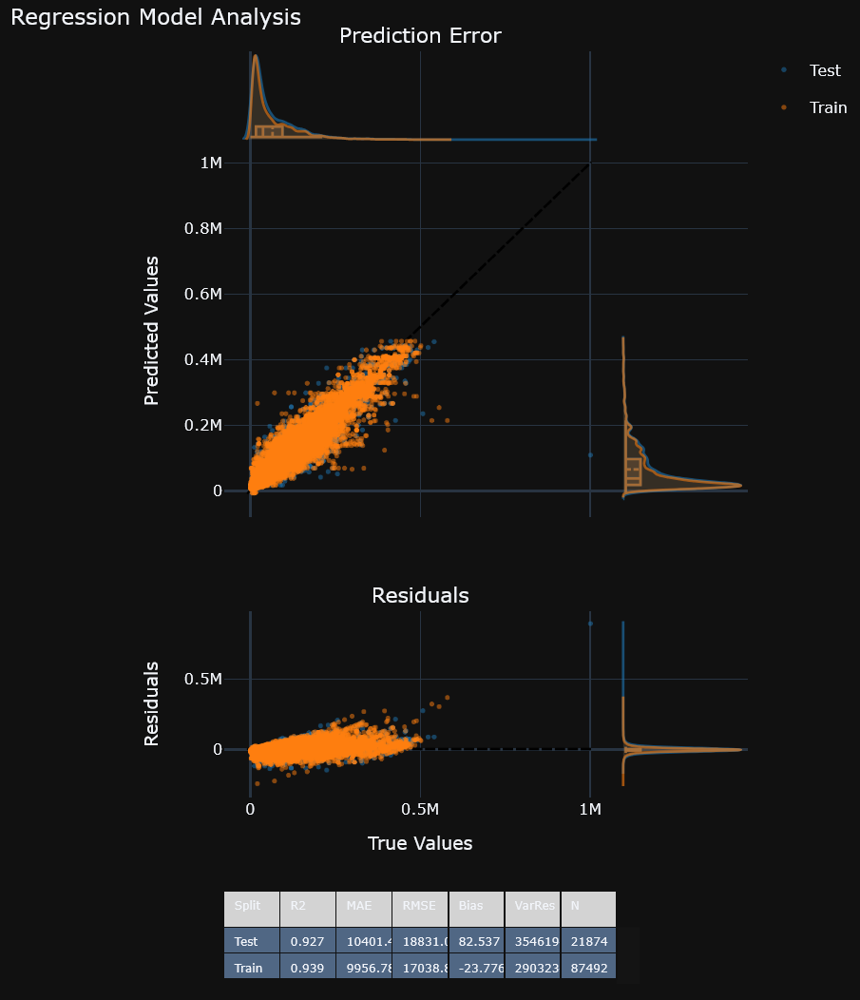

This project creates plots for machine learning similar to yellowbricks https://www.scikit-yb.org/en/latest/.

It uses plotly to generate interactive visualizations and employs a dataframe interface using polars. Just pass you dataframe and specify the columns:
we use the following libraries: plotly, polars

## Notebook widgets (AnyWidget)

Some plots (e.g. the crossfiltering pairplot) are implemented as an **AnyWidget** and require frontend `ipywidgets` support.

If you only see plain text like `PairplotWidget(...)` instead of an interactive plot:

- In VS Code, make sure the workspace is **trusted** and the extensions `ms-toolsai.jupyter` + `ms-toolsai.jupyter-renderers` are enabled.
- Check `Jupyter: Widget Script Sources` (overly strict settings can prevent widget JS from loading).
